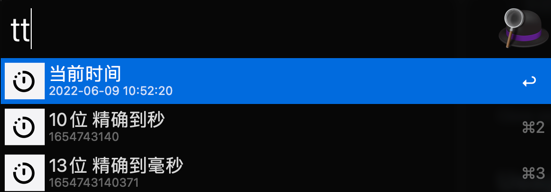
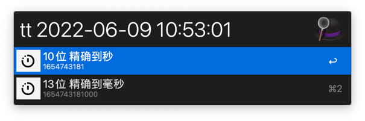
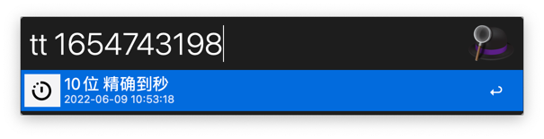
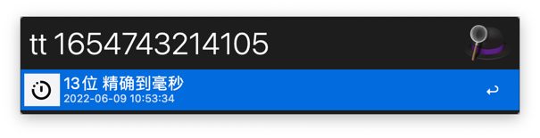

# alfred-time-convert

时间格式相互转换工具，利用Alfred快速进行时间格式转换。
代码比较简单粗暴，没有进行任何优化，只是为了方便使用。

## Features
- 默认显示当前时间的格式化字符串以及秒和毫秒
- 对于传入参数 **2022-09-12 12:01:22** 显示秒和毫秒 
- 传入秒显示格式化时间串
- 传入毫秒显示格式化时间串
- 针对于Intel芯片和ARM芯片进行了适配
- 回车结果会拷贝到剪切板






## Installation

Clone and `make dist` 
然后就是双击安装了
或者从 release 下载


## Usage

in Alfred:

```
tt {query}
```

## License

MIT

## Author

CrazyMouse
